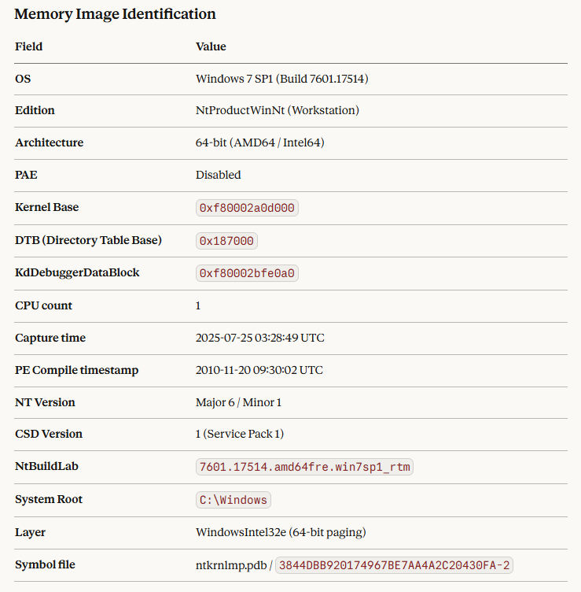
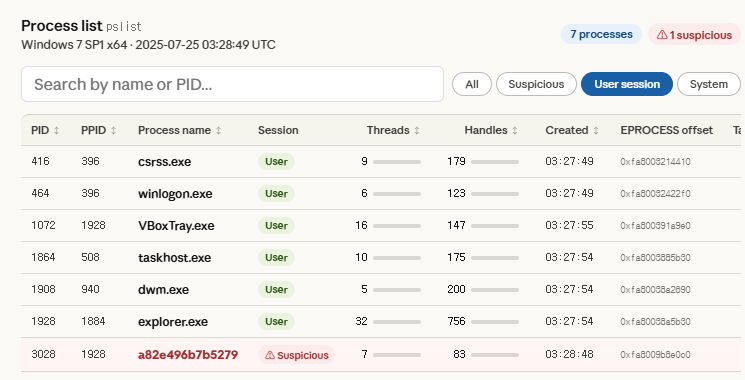

# winmem-vol3-mcp

An MCP (Model Context Protocol) server that wraps the [Volatility3](https://github.com/volatilityfoundation/volatility3) memory forensics framework, enabling conversational Windows memory analysis through Claude Desktop.

> **Windows memory images only.** This project exclusively targets Windows memory dumps. All plugins are sourced from `volatility3.plugins.windows.*`. Linux and macOS memory analysis will be addressed in separate projects.

## Key Features

- **Direct Python API integration** -- calls `volatility3` as a library (`import volatility3`), not via subprocess
- **Structured output** -- TreeGrid results are parsed into typed JSON-serializable dicts, not raw text
- **Session-based context** -- a single Volatility3 Context is built once at startup and reused across all plugin calls
- **Result caching** -- plugin results are cached per session to avoid redundant computation
- **Config caching** -- kernel/layer configuration is saved to `{image}.vol3cfg.json` on first run, skipping expensive PDB download and layer scanning on subsequent starts
- **Forensic-aware tool docstrings** -- each MCP tool carries a three-layer docstring (trigger patterns, return structure, forensic context) that guides the LLM to select the right tool, interpret results accurately, and autonomously chain multi-step analysis workflows
- **Multilingual natural language queries** -- while the codebase and tool outputs are in English, users can ask questions in any language Claude supports (e.g., Korean, Japanese, Chinese, German, etc.) and receive analysis results in the same language

## Installation

Requires Python 3.10+ and [uv](https://docs.astral.sh/uv/). Dependencies are managed via uv and pinned to [Volatility3 2.27.0](https://github.com/volatilityfoundation/volatility3/releases/tag/v2.27.0) (released 2025-01-30).

```bash
git clone https://github.com/cpuu/winmem-vol3-mcp.git
cd winmem-vol3-mcp
uv sync
```

## Usage

### Claude Desktop Configuration

Add the following to your `claude_desktop_config.json`:

```json
{
  "mcpServers": {
    "winmem-vol3-mcp": {
      "command": "uv",
      "args": ["--directory", "/absolute/path/to/winmem-vol3-mcp", "run", "python", "mcp_server.py"],
      "env": {
        "VOL_IMAGE_PATH": "/absolute/path/to/memory.vmem"
      }
    }
  }
}
```

`VOL_IMAGE_PATH` must point to an existing Windows memory image file. The server will not start without it.

### Quick Test

After configuring Claude Desktop, try asking:

> *"Please, identify the memory image."*

Claude will automatically call `windows_info` and present the analysis results in a conversational format:



You can then ask follow-up questions to dig deeper:

> *"Could you list all running processes and flag any that look suspicious?"*



## Available Tools

49 Volatility3 Windows plugins mapped as MCP tools. See [TOOL_CATALOG.md](TOOL_CATALOG.md) for the full list with detailed status.

| Category | Plugins | Implemented |
|---|---|---|
| Process Analysis | pslist, psscan, pstree, cmdline, sessions, getsids, privileges, envars, handles, joblinks, thrdscan | 11 / 11 |
| Memory Analysis | malfind, vadinfo, vadwalk, memmap, virtmap, strings | 6 / 6 |
| Module / DLL Analysis | dlllist, ldrmodules, modules, modscan, verinfo, iat | 6 / 6 |
| Network Analysis | netscan, netstat | 2 / 2 |
| Kernel / Driver Analysis | bigpools, callbacks, driverscan, driverirp, drivermodule, devicetree, ssdt, poolscanner | 8 / 8 |
| File Analysis | filescan, dumpfiles, symlinkscan, mutantscan | 0 / 4 |
| Registry Analysis | registry.hivelist, registry.hivescan, registry.printkey, registry.userassist, registry.certificates | 0 / 5 |
| System Information | info, statistics, crashinfo | 1 / 3 |
| Security / Malware | skeleton_key_check, mbrscan, truecrypt, getservicesids | 0 / 4 |

## Architecture

```
Claude Desktop  <-->  MCP Server (stdio)  <-->  volatility3 (Python import)
                            |
                         Session
                            +-- Context (built once, reused)
                            +-- Config cache ({image}.vol3cfg.json)
                            +-- Result cache (plugin name -> result)
```

A single memory image is fixed per server session. This is intentional -- it ensures all plugin results within a session refer to exactly one memory image, maintaining analytical rigor.

## License

Apache-2.0
