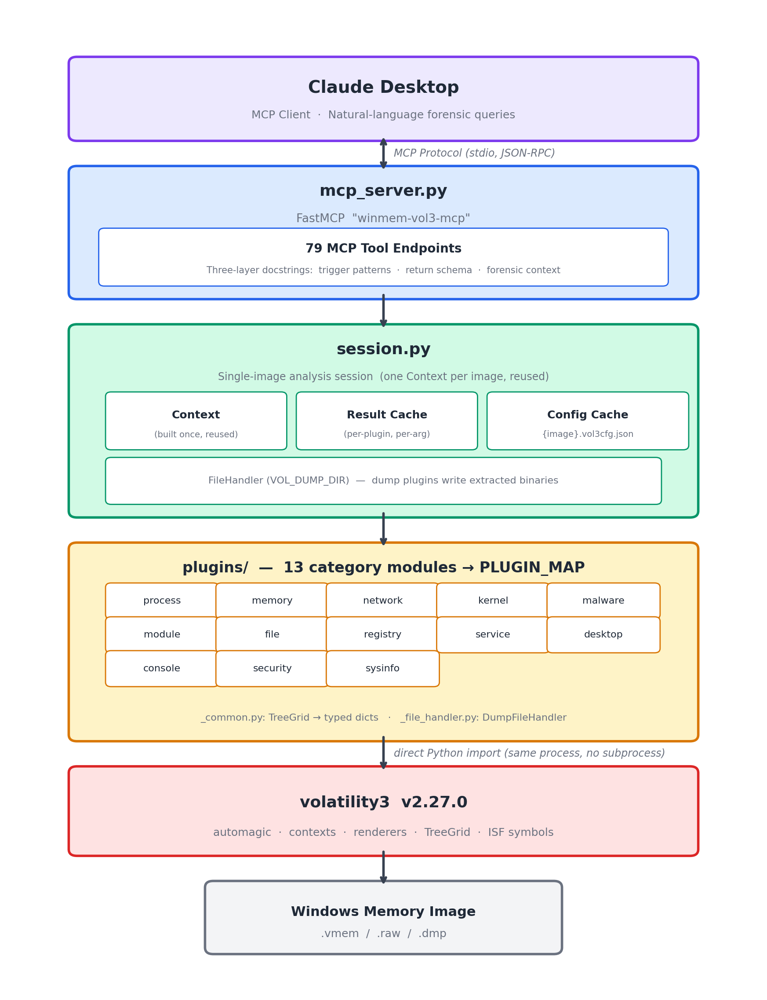

# winmem-vol3-mcp

An MCP (Model Context Protocol) server that wraps the [Volatility3](https://github.com/volatilityfoundation/volatility3) memory forensics framework, enabling conversational Windows memory analysis through Claude Desktop.

> **Windows memory images only.** This project exclusively targets Windows memory dumps. All plugins are sourced from `volatility3.plugins.windows.*`. Linux and macOS memory analysis will be addressed in separate projects.

## Key Features

- **Direct Volatility3 integration** -- imports `volatility3` as a library (no subprocess) and parses every TreeGrid into typed, JSON-serializable dicts that Claude can reason over directly.
- **Stateful session with multi-layer caching** -- a single Volatility3 Context is built once at startup and reused across all calls. Plugin results are cached per session (keyed by arguments for parameterized tools), and kernel/layer config persists to `{image}.vol3cfg.json` so subsequent starts skip PDB downloads and layer scanning.
- **Rich query surface** -- parameterized tools accept typed arguments (e.g., `windows_vadregexscan(pattern)`); dump tools (`windows_dumpfiles`, `windows_pedump`, ...) write recovered binaries to the directory set by `VOL_DUMP_DIR` and return only the on-disk path, keeping bytes out of Claude's context while leaving them immediately available for IDA / YARA / sandbox follow-up.
- **Forensic-aware tool docstrings** -- every tool carries a three-layer docstring (trigger patterns / return schema / forensic context) that helps Claude pick the right tool, interpret results accurately, and chain multi-step analysis workflows on its own.
- **Windows-version-aware plugin execution** -- per-plugin behaviour across Windows 7 / 8 / 10 / 11 (and specific Win10 builds) is audited and catalogued in [`TOOL_CATALOG.md`](TOOL_CATALOG.md) — hard restrictions, implicit OS dependencies, and version-aware adapters — so empty output is correctly read as "OS-incompatible" rather than a tooling failure.
- **Multilingual natural-language queries** -- codebase and tool outputs are in English, but users can ask in any language Claude supports (Korean, Japanese, Chinese, German, ...) and receive analysis in the same language.

## Installation

Requires Python 3.10+ and [uv](https://docs.astral.sh/uv/). 

Dependencies are managed via uv and pinned to [Volatility3 2.27.0](https://github.com/volatilityfoundation/volatility3/releases/tag/v2.27.0) (released 2026-01-30).

```bash
git clone https://github.com/cpuu/winmem-vol3-mcp.git
cd winmem-vol3-mcp
uv sync
```

## Usage

### Claude Desktop Configuration

Add the following to your `claude_desktop_config.json`:

```json
{
  "mcpServers": {
    "winmem-vol3-mcp": {
      "command": "uv",
      "args": ["--directory", "/absolute/path/to/winmem-vol3-mcp", "run", "python", "mcp_server.py"],
      "env": {
        "VOL_IMAGE_PATH": "/absolute/path/to/memory.vmem",
        "VOL_DUMP_DIR": "/absolute/path/to/dumps"
      }
    }
  }
}
```

`VOL_IMAGE_PATH` must point to an existing Windows memory image file. The server will not start without it.

`VOL_DUMP_DIR` is optional. When set, dump tools such as `windows_dumpfiles` write recovered bytes into this directory (it is created on first use, and filename collisions are resolved by appending `-1`, `-2`, ...). When unset, calling any dump tool raises a clear error so Claude can ask the user to configure it.

### Quick Test

After configuring Claude Desktop, try asking:

> *"Please, identify the memory image."*

Claude will automatically call `windows_info` and present the analysis results in a conversational format:


You can then ask follow-up questions to dig deeper:

> *"Could you list all running processes and flag any that look suspicious?"*


## Available Tools

Volatility3 v2.27.0 ships 91 Windows plugin classes (`volatility3.plugins.windows.*`). Of these, 12 are deprecated `PluginRenameClass` wrappers that simply redirect to a canonical path already exposed by this server. The remaining **79 canonical plugins** are all integrated as MCP tools -- 100% non-deprecated coverage. See [TOOL_CATALOG.md](TOOL_CATALOG.md) for the complete reference including the deprecated-alias audit table.

| Category | Plugins |
|---|---|
| Process Analysis | pslist, psscan, pstree, cmdline, sessions, getsids, privileges, envars, handles, joblinks, thrdscan, threads |
| Memory Analysis | vadinfo, vadwalk, memmap, virtmap, strings, shimcachemem, vadregexscan |
| Module / DLL Analysis | dlllist, modules, modscan, verinfo, iat, pe_symbols, pedump |
| Network Analysis | netscan, netstat |
| Kernel / Driver Analysis | bigpools, callbacks, driverscan, driverirp, devicetree, ssdt, poolscanner, orphan_kernel_threads, kpcrs, unloadedmodules, timers, debugregisters, etwpatch |
| File Analysis | filescan, dumpfiles, symlinkscan, mutantscan |
| Registry Analysis | registry.hivelist, registry.hivescan, registry.printkey, registry.userassist, registry.certificates, registry.scheduled_tasks, registry.getcellroutine, registry.amcache |
| Service Analysis | svcscan, svclist |
| Desktop / GUI | windowstations, desktops, deskscan, windows |
| Console / Shell | consoles, cmdscan |
| System Information | info, statistics, crashinfo |
| Security / Integrity | mbrscan, truecrypt, getservicesids, suspended_threads |
| Malware Detection | malware.drivermodule, malware.ldrmodules, malware.malfind, malware.skeleton_key_check, malware.unhooked_system_calls, malware.svcdiff, malware.processghosting, malware.hollowprocesses, malware.pebmasquerade, malware.suspicious_threads, malware.psxview |

## Architecture



A single memory image is fixed per server session. This is intentional -- it ensures all plugin results within a session refer to exactly one memory image, maintaining analytical rigor.

## License

Apache-2.0
